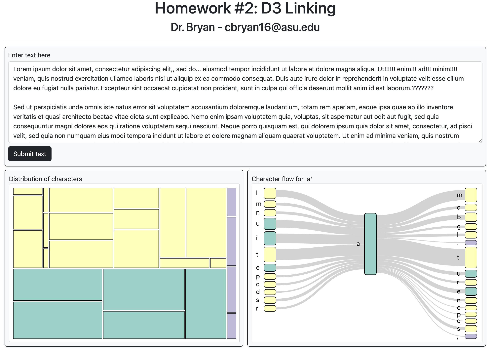

# Interactive Treemap and Sankey Diagram Visualization

This project creates an interactive text-based visualization tool using **D3.js**. It dynamically generates two linked charts—a **Treemap** and a **Sankey Diagram**—to analyze character distributions and flows within a user-submitted text.

---

## Project Overview

The interface consists of three main panels:

1. **Text Input Panel**: A textarea allows users to enter custom text. Pressing the **Submit** button processes the text and generates a Treemap visualization.

2. **Treemap Visualization**:
   - Visualizes the **distribution of characters** (vowels, consonants, and punctuation) in the input text.
   - Characters are grouped into categories (vowels, consonants, and punctuation) with rectangles sized proportionally to their count.

3. **Sankey Diagram Visualization**:
   - Displays **character flow** for a selected character from the Treemap.
   - The diagram shows:
     - **Left Column**: Characters immediately preceding the selected character.
     - **Middle Column**: The selected character itself.
     - **Right Column**: Characters immediately following the selected character.
   - Node sizes in the Sankey diagram reflect the frequency of character combinations.

---

## Features

### 1. **Treemap Visualization**
- Displays character counts grouped into **vowels, consonants, and punctuation**.
- Rectangles are sized proportionally to character frequency.
- Categorical colors distinguish between groups:
   - **Vowels**: One color
   - **Consonants**: Another color
   - **Punctuation**: A third color
- Hovering over a rectangle shows a **tooltip** with the character and its count.
- Clicking on a rectangle generates a corresponding Sankey diagram.

### 2. **Sankey Diagram**
- Created dynamically when a character in the Treemap is clicked.
- Represents the **flow of characters**:
   - Left: Characters that appear immediately before the selected character.
   - Middle: The selected character.
   - Right: Characters that appear immediately after the selected character.
- Node sizes reflect the frequency of character combinations.
- Hovering over nodes displays a **tooltip** showing details about the flow.

### 3. **Interactivity**
- Dynamic generation of visualizations based on user input.
- Tooltips provide additional insights for both the Treemap and Sankey charts.
- The interface clears and updates as new text is submitted or new characters are selected.

---

## How It Works

1. **Input and Data Parsing**:
   - User enters text into the textarea and clicks the **Submit** button.
   - Text is parsed to count occurrences of:
     - **Vowels** (including 'y')
     - **Consonants**
     - **Punctuation** characters (., !, ?, :, ;).
   - Case-insensitive parsing ensures consistency.

2. **Treemap Generation**:
   - Data is organized hierarchically to group characters into categories.
   - Rectangles are sized based on character counts and displayed in a Treemap.

3. **Sankey Diagram Generation**:
   - Clicking on a Treemap rectangle creates a dataset showing:
     - Characters immediately **before** and **after** the selected character.
   - The Sankey diagram visualizes this flow, with nodes sized proportionally to their frequency.

4. **Tooltips**:
   - Tooltips follow the cursor and display:
     - **Treemap**: Character and its count.
     - **Sankey**:
       - Left column: Frequency of preceding character flows.
       - Middle column: Frequency of the selected character.
       - Right column: Frequency of subsequent character flows.

---

## Folder Structure

- **index.html**: Main HTML file that structures the interface.
- **shailyro.js**: JavaScript file implementing the D3.js logic for Treemap and Sankey visualizations.
- **style.css**: CSS for styling the layout and elements.
- **data/**: Contains any preprocessed or sample text data (if applicable).
- **imgs/**: Optional folder for screenshots or example visuals.

---

## How to Use

1. **Clone the Repository**:
   ```bash
   git clone <repository-link>
   ```

2. **Run a Local Server**:
   Use a simple HTTP server to view the project locally:
   ```bash
   python3 -m http.server
   ```
   Open `index.html` in a browser.

3. **Interact with the Tool**:
   - Enter a block of text in the textarea.
   - Click the **Submit** button to generate the Treemap.
   - Click on any character in the Treemap to generate its corresponding Sankey diagram.
   - Hover over rectangles in both charts to view detailed tooltips.

---

## Preview

Below is an example of the project interface:

**Treemap and Sankey Diagram Example**  


